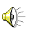
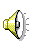
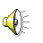

# Notifications
Only the main icons are shown here (without symlinked duplicates, in sizes from 1000000x1000000 to 0x0). The full icon list with sizes from 1000000x1000000 to 0x0 is there: [icons.md](icons.md)

| |**16x16**|**24x24**|**32x32**|**48x48**|
|-|-|-|-|-|
|**audio-volume-high**|||||
|**audio-volume-low**|||||
|**audio-volume-medium**|||||
|**audio-volume-muted**|||||
|**audio-volume-off**|||||
|**krb-expiring-ticket**|||||
|**krb-no-valid-ticket**|||||
|**notification-audio-next**|||||
|**notification-audio-pause**|||||
|**notification-audio-play**|||||
|**notification-audio-previous**|||||
|**notification-audio-stop**|||||
|**notification-device-eject**|||||
|**notification-device-firewire**|||||
|**notification-display-brightness-full**|||||
|**notification-display-brightness-high**|||||
|**notification-display-brightness-low**|||||
|**notification-display-brightness-medium**|||||
|**notification-display-brightness-off**|||||
|**notification-message-im**|||||
|**notification-network-ethernet-connected**|||||
|**notification-network-ethernet-disconnected**|||||
|**notification-network-wireless-disconnected**|||||
|**notification-network-wireless-full**|||||
|**notification-network-wireless-high**|||||
|**notification-network-wireless-low**|||||
|**notification-network-wireless-medium**|||||
|**notification-network-wireless-none**|||||
|**notification-power-disconnected**|||||
|**xfpm-brightness-keyboard**|||||
|**xfpm-brightness-lcd**|||||
