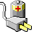
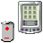
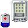

# Panel

Total **362** icons in **panel** context.

| |**16x16**|**22x22**|**24x24**|**32x32**|**48x48**|**scalable**|
|-|-|-|-|-|-|-|
|**ac-adapter**|

*link:* 
*xfpm-ac-adapter.png*
||||||
|**account-logged-in**|||||||
|**applications-chat-panel**|

*link:* 
*user-available-panel.png*
|

*link:* 
*user-available-panel.png*
|

*link:* 
*user-available-panel.png*
||||
|**applications-email-panel**||

*link:* 
*indicator-messages.png*
|||||
|**audio-input-microphone-high-panel**|||||||
|**audio-input-microphone-high**|

*link:* 
*microphone-sensitivity-high.png*
||||||
|**audio-input-microphone-low-zero-panel**|

*link:* 
*audio-input-microphone-none-panel.png*
|

*link:* 
*audio-input-microphone-none-panel.png*
|||||
|**audio-input-microphone-low-zero**|

*link:* 
*microphone-sensitivity-low.png*
||||||
|**audio-input-microphone-medium-panel**|

*link:* 
*microphone-sensitivity-medium.png*
||||||
|**audio-input-microphone-medium**|

*link:* 
*microphone-sensitivity-medium.png*
||||||
|**audio-input-microphone-muted**|

*link:* 
*microphone-sensitivity-muted.png*
||||||
|**audio-input-microphone-none-panel**|||||||
|**audio-input-microphone-none**|

*link:* 
*microphone-sensitivity-muted.png*
||||||
|**audio-output-none-panel**|||||||
|**audio-volume-high-panel**|

*link:* 
*audio-volume-high.png*
||||||
|**audio-volume-high**||

*link:* 
*audio-volume-high-panel.png*
|||||
|**audio-volume-low-panel**|

*link:* 
*audio-volume-low.png*
||||||
|**audio-volume-low-zero-panel**|

*link:* 
*audio-volume-low-zero.png*
||||||
|**audio-volume-low-zero**|||||||
|**audio-volume-low**||

*link:* 
*audio-volume-low-panel.png*
|||||
|**audio-volume-medium-panel**|

*link:* 
*audio-volume-medium.png*
||||||
|**audio-volume-medium**||

*link:* 
*audio-volume-medium-panel.png*
|||||
|**audio-volume-muted-blocking-panel**|||||||
|**audio-volume-muted-panel**|

*link:* 
*audio-volume-low-zero.png*
||||||
|**audio-volume-muted**|

*link:* 
*audio-volume-low-zero.png*
|

*link:* 
*audio-volume-muted-panel.png*
|||||
|**audio-volume-off**||

*link:* 
*audio-volume-muted-panel.png*
|||||
|**banshee-panel**|||||||
|**battery-000-charging**||

*link:* 
*gpm-battery-000-charging.png*
|

*link:* 
*gpm-battery-000-charging.png*
||||
|**battery-000**||

*link:* 
*gpm-battery-000.png*
|

*link:* 
*gpm-battery-000.png*
||||
|**battery-020-charging**||

*link:* 
*gpm-battery-020-charging.png*
|

*link:* 
*gpm-battery-020-charging.png*
||||
|**battery-020**|

*link:* 
*battery-low.png*
|

*link:* 
*gpm-battery-020.png*
|

*link:* 
*gpm-battery-020.png*
||||
|**battery-040-charging**||

*link:* 
*gpm-battery-040-charging.png*
|

*link:* 
*gpm-battery-040-charging.png*
||||
|**battery-040**|

*link:* 
*battery-low.png*
|

*link:* 
*gpm-battery-040.png*
|

*link:* 
*gpm-battery-040.png*
||||
|**battery-060-charging**||

*link:* 
*gpm-battery-060-charging.png*
|

*link:* 
*gpm-battery-060-charging.png*
||||
|**battery-060**|

*link:* 
*battery-good.png*
|

*link:* 
*gpm-battery-060.png*
|

*link:* 
*gpm-battery-060.png*
||||
|**battery-080-charging**||

*link:* 
*gpm-battery-080-charging.png*
|

*link:* 
*gpm-battery-080-charging.png*
||||
|**battery-080**|

*link:* 
*battery-good.png*
|

*link:* 
*gpm-battery-080.png*
|

*link:* 
*gpm-battery-080.png*
||||
|**battery-100-charging**||

*link:* 
*gpm-battery-100-charging.png*
|

*link:* 
*gpm-battery-100-charging.png*
||||
|**battery-100**|

*link:* 
*battery-full.png*
|

*link:* 
*gpm-battery-100.png*
|

*link:* 
*gpm-battery-100.png*
||||
|**battery-caution-charging**||

*link:* 
*gpm-battery-020-charging.png*
|

*link:* 
*gpm-battery-020-charging.png*
||||
|**battery-caution-symbolic**|||||||
|**battery-caution**||

*link:* 
*gpm-battery-020.png*
|

*link:* 
*gpm-battery-020.png*
||||
|**battery-charged**||

*link:* 
*gpm-battery-charged.png*
|

*link:* 
*gpm-battery-charged.png*
||||
|**battery-empty-charging**||

*link:* 
*gpm-battery-000-charging.png*
|

*link:* 
*gpm-battery-000-charging.png*
||||
|**battery-empty-symbolic**|||||||
|**battery-empty**||

*link:* 
*gpm-battery-empty.png*
|

*link:* 
*gpm-battery-empty.png*
||||
|**battery-full-charged**||

*link:* 
*gpm-battery-100-charging.png*
|

*link:* 
*gpm-battery-100-charging.png*
||||
|**battery-full-charging**||

*link:* 
*gpm-battery-100-charging.png*
|

*link:* 
*gpm-battery-100-charging.png*
||||
|**battery-full-symbolic**|||||||
|**battery-full**|||||||
|**battery-good-charging**||

*link:* 
*gpm-battery-060-charging.png*
|

*link:* 
*gpm-battery-060-charging.png*
||||
|**battery-good-symbolic**|||||||
|**battery-good**||

*link:* 
*gpm-battery-060.png*
|

*link:* 
*gpm-battery-060.png*
||||
|**battery-level-0-charging**|

*link:* 
*battery-000-charging.png*
|

*link:* 
*battery-000-charging.png*
|

*link:* 
*battery-000-charging.png*
||||
|**battery-level-0**|

*link:* 
*battery-000.png*
|

*link:* 
*battery-000.png*
|

*link:* 
*battery-000.png*
||||
|**battery-level-10-charging**|

*link:* 
*battery-020-charging.png*
|

*link:* 
*battery-020-charging.png*
|

*link:* 
*battery-020-charging.png*
||||
|**battery-level-10**|

*link:* 
*battery-020.png*
|

*link:* 
*battery-020.png*
|

*link:* 
*battery-020.png*
||||
|**battery-level-100-charged**|

*link:* 
*battery-100-charging.png*
|

*link:* 
*battery-100-charging.png*
|

*link:* 
*battery-100-charging.png*
||||
|**battery-level-100**|

*link:* 
*battery-100.png*
|

*link:* 
*battery-100.png*
|

*link:* 
*battery-100.png*
||||
|**battery-level-20-charging**|

*link:* 
*battery-020-charging.png*
|

*link:* 
*battery-020-charging.png*
|

*link:* 
*battery-020-charging.png*
||||
|**battery-level-20**|

*link:* 
*battery-020.png*
|

*link:* 
*battery-020.png*
|

*link:* 
*battery-020.png*
||||
|**battery-level-30-charging**|

*link:* 
*battery-040-charging.png*
|

*link:* 
*battery-040-charging.png*
|

*link:* 
*battery-040-charging.png*
||||
|**battery-level-30**|

*link:* 
*battery-040.png*
|

*link:* 
*battery-040.png*
|

*link:* 
*battery-040.png*
||||
|**battery-level-40-charging**|

*link:* 
*battery-040-charging.png*
|

*link:* 
*battery-040-charging.png*
|

*link:* 
*battery-040-charging.png*
||||
|**battery-level-40**|

*link:* 
*battery-040.png*
|

*link:* 
*battery-040.png*
|

*link:* 
*battery-040.png*
||||
|**battery-level-50-charging**|

*link:* 
*battery-060-charging.png*
|

*link:* 
*battery-060-charging.png*
|

*link:* 
*battery-060-charging.png*
||||
|**battery-level-50**|

*link:* 
*battery-060.png*
|

*link:* 
*battery-060.png*
|

*link:* 
*battery-060.png*
||||
|**battery-level-60-charging**|

*link:* 
*battery-060-charging.png*
|

*link:* 
*battery-060-charging.png*
|

*link:* 
*battery-060-charging.png*
||||
|**battery-level-60**|

*link:* 
*battery-060.png*
|

*link:* 
*battery-060.png*
|

*link:* 
*battery-060.png*
||||
|**battery-level-70-charging**|

*link:* 
*battery-080-charging.png*
|

*link:* 
*battery-080-charging.png*
|

*link:* 
*battery-080-charging.png*
||||
|**battery-level-70**|

*link:* 
*battery-080.png*
|

*link:* 
*battery-080.png*
|

*link:* 
*battery-080.png*
||||
|**battery-level-80-charging**|

*link:* 
*battery-080-charging.png*
|

*link:* 
*battery-080-charging.png*
|

*link:* 
*battery-080-charging.png*
||||
|**battery-level-80**|

*link:* 
*battery-080.png*
|

*link:* 
*battery-080.png*
|

*link:* 
*battery-080.png*
||||
|**battery-level-90-charging**|

*link:* 
*battery-080-charging.png*
|

*link:* 
*battery-080-charging.png*
|

*link:* 
*battery-080-charging.png*
||||
|**battery-level-90**|

*link:* 
*battery-080.png*
|

*link:* 
*battery-080.png*
|

*link:* 
*battery-080.png*
||||
|**battery-low-charging**||

*link:* 
*gpm-battery-040-charging.png*
|

*link:* 
*gpm-battery-040-charging.png*
||||
|**battery-low-symbolic**|||||||
|**battery-low**||

*link:* 
*gpm-battery-040.png*
|

*link:* 
*gpm-battery-040.png*
||||
|**battery-missing**|

*link:* 
*gpm-battery-missing.png*
|

*link:* 
*gpm-battery-missing.png*
|

*link:* 
*gpm-battery-missing.png*
||||
|**battery_charged**|

*link:* 
*gpm-battery-charged.png*
|

*link:* 
*gpm-battery-charged.png*
|

*link:* 
*gpm-battery-charged.png*
||||
|**battery_full**|

*link:* 
*battery-100-charging.png*
|

*link:* 
*gpm-battery-100.png*
|

*link:* 
*gpm-battery-100.png*
||||
|**battery_plugged**|

*link:* 
*gpm-ac-adapter.png*
|

*link:* 
*gpm-ac-adapter.png*
|

*link:* 
*gpm-ac-adapter.png*
||||
|**blueberry-tray-active**|

*link:* 
*bluetooth-paired.png*
|

*link:* 
*bluetooth-paired.png*
|

*link:* 
*bluetooth-paired.png*
||||
|**blueberry-tray-disabled**|

*link:* 
*bluetooth-disabled.png*
|

*link:* 
*bluetooth-disabled.png*
|

*link:* 
*bluetooth-disabled.png*
||||
|**blueberry-tray**|

*link:* 
*bluetooth-active.png*
|

*link:* 
*bluetooth-active.png*
|

*link:* 
*bluetooth-active.png*
||||
|**blueman-active**|

*link:* 
*bluetooth-paired.png*
|

*link:* 
*bluetooth-paired.png*
|

*link:* 
*bluetooth-paired.png*
||||
|**blueman-disabled**|

*link:* 
*bluetooth-disabled.png*
|

*link:* 
*bluetooth-disabled.png*
|

*link:* 
*bluetooth-disabled.png*
||||
|**blueman-tray-active**|

*link:* 
*bluetooth-paired.png*
|

*link:* 
*bluetooth-paired.png*
|

*link:* 
*bluetooth-paired.png*
||||
|**blueman-tray-disabled**|

*link:* 
*bluetooth-disabled.png*
|

*link:* 
*bluetooth-disabled.png*
|

*link:* 
*bluetooth-disabled.png*
||||
|**blueman-tray**|

*link:* 
*bluetooth-active.png*
|

*link:* 
*bluetooth-active.png*
|

*link:* 
*bluetooth-active.png*
||||
|**blueman**||

*link:* 
*bluetooth-active.png*
|

*link:* 
*bluetooth-active.png*
||||
|**bluetooth-active**|||||||
|**bluetooth-disabled**|||||||
|**bluetooth-paired**|||||||
|**caffeine-cup-empty**|||||||
|**caffeine-cup-full**|||||||
|**clipman**|||||||
|**content-loading-symbolic**|

*link:* 
*content-loading.png*
||||||
|**content-loading**|||||||
|**dropboxstatus-busy**|||||||
|**dropboxstatus-busy2**|||||||
|**dropboxstatus-idle**|||||||
|**dropboxstatus-logo**|||||||
|**dropboxstatus-x**|||||||
|**empathy-available**|||||||
|**empathy-away**|||||||
|**empathy-busy**|||||||
|**empathy-extended-away**|

*link:* 
*empathy-away.png*
||||||
|**empathy-offline**|||||||
|**empathy-pending**|

*link:* 
*empathy-away.png*
||||||
|**gnome-do-symbolic**|||||||
|**gnome-main-menu**||

*link:* 
*start-here.png*
|

*link:* 
*start-here.png*
||||
|**gpm-ac-adapter**|||||||
|**gpm-battery-000-charging**|||||

*link:* 
*../../status/48/battery-000-charging.png*
||
|**gpm-battery-000**|

*link:* 
*gpm-primary-000.png*
||||

*link:* 
*../../status/48/battery-000.png*
||
|**gpm-battery-020-charging**|||||

*link:* 
*../../status/48/battery-020-charging.png*
||
|**gpm-battery-020**|

*link:* 
*gpm-primary-020.png*
||||

*link:* 
*../../status/48/battery-020.png*
||
|**gpm-battery-040-charging**|||||

*link:* 
*../../status/48/battery-040-charging.png*
||
|**gpm-battery-040**|

*link:* 
*gpm-primary-040.png*
||||

*link:* 
*../../status/48/battery-040.png*
||
|**gpm-battery-060-charging**|||||

*link:* 
*../../status/48/battery-060-charging.png*
||
|**gpm-battery-060**|

*link:* 
*gpm-primary-060.png*
||||

*link:* 
*../../status/48/battery-060.png*
||
|**gpm-battery-080-charging**|||||

*link:* 
*../../status/48/battery-080-charging.png*
||
|**gpm-battery-080**|

*link:* 
*gpm-primary-080.png*
||||

*link:* 
*../../status/48/battery-080.png*
||
|**gpm-battery-100-charging**|||||

*link:* 
*../../status/48/battery-100-charging.png*
||
|**gpm-battery-100**|

*link:* 
*gpm-primary-100.png*
||||

*link:* 
*../../status/48/battery-100.png*
||
|**gpm-battery-charged**|||||

*link:* 
*gpm-battery-100.png*
||
|**gpm-battery-empty**|

*link:* 
*battery-empty.png*
|

*link:* 
*gpm-battery-000.png*
|

*link:* 
*gpm-battery-000.png*
||

*link:* 
*gpm-battery-000.png*
||
|**gpm-battery-missing**|

*link:* 
*battery-empty.png*
|

*link:* 
*gpm-battery-000.png*
|

*link:* 
*gpm-battery-000.png*
||

*link:* 
*gpm-battery-000.png*
||
|**gpm-inhibit**|||||||
|**gpm-keyboard-000**|||||||
|**gpm-keyboard-020**|||||||
|**gpm-keyboard-040**|||||||
|**gpm-keyboard-060**|||||||
|**gpm-keyboard-080**|||||||
|**gpm-keyboard-100**|||||||
|**gpm-mouse-000**|||||||
|**gpm-mouse-020**|||||||
|**gpm-mouse-040**|||||||
|**gpm-mouse-060**|||||||
|**gpm-mouse-080**|||||||
|**gpm-mouse-100**|||||||
|**gpm-phone-000**|||||||
|**gpm-phone-020**|||||||
|**gpm-phone-040**|||||||
|**gpm-phone-060**|||||||
|**gpm-phone-080**|||||||
|**gpm-phone-100**|||||||
|**gpm-phone-100_alt**||

*link:* 
*gpm-phone-100.png*
|||||
|**gpm-primary-000-charging**|

*link:* 
*gpm-battery-000-charging.png*
|

*link:* 
*gpm-battery-000-charging.png*
|

*link:* 
*gpm-battery-000-charging.png*
||

*link:* 
*gpm-battery-000-charging.png*
||
|**gpm-primary-000**||

*link:* 
*gpm-battery-000.png*
|

*link:* 
*gpm-battery-000.png*
||

*link:* 
*gpm-battery-000.png*
||
|**gpm-primary-020-charging**|

*link:* 
*gpm-battery-020-charging.png*
|

*link:* 
*gpm-battery-020-charging.png*
|

*link:* 
*gpm-battery-020-charging.png*
||

*link:* 
*gpm-battery-020-charging.png*
||
|**gpm-primary-020**||

*link:* 
*gpm-battery-020.png*
|

*link:* 
*gpm-battery-020.png*
||

*link:* 
*gpm-battery-020.png*
||
|**gpm-primary-040-charging**|

*link:* 
*gpm-battery-040-charging.png*
|

*link:* 
*gpm-battery-040-charging.png*
|

*link:* 
*gpm-battery-040-charging.png*
||

*link:* 
*gpm-battery-040-charging.png*
||
|**gpm-primary-040**||

*link:* 
*gpm-battery-040.png*
|

*link:* 
*gpm-battery-040.png*
||

*link:* 
*gpm-battery-040.png*
||
|**gpm-primary-060-charging**|

*link:* 
*gpm-battery-060-charging.png*
|

*link:* 
*gpm-battery-060-charging.png*
|

*link:* 
*gpm-battery-060-charging.png*
||

*link:* 
*gpm-battery-060-charging.png*
||
|**gpm-primary-060**||

*link:* 
*gpm-battery-060.png*
|

*link:* 
*gpm-battery-060.png*
||

*link:* 
*gpm-battery-060.png*
||
|**gpm-primary-080-charging**|

*link:* 
*gpm-battery-080-charging.png*
|

*link:* 
*gpm-battery-080-charging.png*
|

*link:* 
*gpm-battery-080-charging.png*
||

*link:* 
*gpm-battery-080-charging.png*
||
|**gpm-primary-080**||

*link:* 
*gpm-battery-080.png*
|

*link:* 
*gpm-battery-080.png*
||

*link:* 
*gpm-battery-080.png*
||
|**gpm-primary-100-charging**|

*link:* 
*gpm-battery-100-charging.png*
|

*link:* 
*gpm-battery-100-charging.png*
|

*link:* 
*gpm-battery-100-charging.png*
||

*link:* 
*gpm-battery-100-charging.png*
||
|**gpm-primary-100**||

*link:* 
*gpm-battery-100.png*
|

*link:* 
*gpm-battery-100.png*
||

*link:* 
*gpm-battery-100.png*
||
|**gpm-primary-charged**|

*link:* 
*gpm-battery-charged.png*
|

*link:* 
*gpm-battery-charged.png*
|

*link:* 
*gpm-battery-charged.png*
||

*link:* 
*gpm-battery-charged.png*
||
|**gpm-ups-000-charging**|

*link:* 
*gpm-battery-000-charging.png*
|

*link:* 
*gpm-battery-000-charging.png*
|

*link:* 
*gpm-battery-000-charging.png*
||

*link:* 
*gpm-battery-000-charging.png*
||
|**gpm-ups-000**|

*link:* 
*gpm-primary-000.png*
|

*link:* 
*gpm-battery-000.png*
|

*link:* 
*gpm-battery-000.png*
||

*link:* 
*gpm-battery-000.png*
||
|**gpm-ups-020-charging**|

*link:* 
*gpm-battery-020-charging.png*
|

*link:* 
*gpm-battery-020-charging.png*
|

*link:* 
*gpm-battery-020-charging.png*
||

*link:* 
*gpm-battery-020-charging.png*
||
|**gpm-ups-020**|

*link:* 
*gpm-primary-020.png*
|

*link:* 
*gpm-battery-020.png*
|

*link:* 
*gpm-battery-020.png*
||

*link:* 
*gpm-battery-020.png*
||
|**gpm-ups-040-charging**|

*link:* 
*gpm-battery-040-charging.png*
|

*link:* 
*gpm-battery-040-charging.png*
|

*link:* 
*gpm-battery-040-charging.png*
||

*link:* 
*gpm-battery-040-charging.png*
||
|**gpm-ups-040**|

*link:* 
*gpm-primary-040.png*
|

*link:* 
*gpm-battery-040.png*
|

*link:* 
*gpm-battery-040.png*
||

*link:* 
*gpm-battery-040.png*
||
|**gpm-ups-060-charging**|

*link:* 
*gpm-battery-060-charging.png*
|

*link:* 
*gpm-battery-060-charging.png*
|

*link:* 
*gpm-battery-060-charging.png*
||

*link:* 
*gpm-battery-060-charging.png*
||
|**gpm-ups-060**|

*link:* 
*gpm-primary-060.png*
|

*link:* 
*gpm-battery-060.png*
|

*link:* 
*gpm-battery-060.png*
||

*link:* 
*gpm-battery-060.png*
||
|**gpm-ups-080-charging**|

*link:* 
*gpm-battery-080-charging.png*
|

*link:* 
*gpm-battery-080-charging.png*
|

*link:* 
*gpm-battery-080-charging.png*
||

*link:* 
*gpm-battery-080-charging.png*
||
|**gpm-ups-080**|

*link:* 
*gpm-primary-080.png*
|

*link:* 
*gpm-battery-080.png*
|

*link:* 
*gpm-battery-080.png*
||

*link:* 
*gpm-battery-080.png*
||
|**gpm-ups-100-charging**|

*link:* 
*gpm-battery-100-charging.png*
|

*link:* 
*gpm-battery-100-charging.png*
|

*link:* 
*gpm-battery-100-charging.png*
||

*link:* 
*gpm-battery-100-charging.png*
||
|**gpm-ups-100**|

*link:* 
*gpm-primary-100.png*
|

*link:* 
*gpm-battery-100.png*
|

*link:* 
*gpm-battery-100.png*
||

*link:* 
*gpm-battery-100.png*
||
|**gpm-ups-missing**|

*link:* 
*battery-empty.png*
|

*link:* 
*gpm-battery-missing.png*
|

*link:* 
*gpm-battery-missing.png*
||

*link:* 
*gpm-battery-missing.png*
||
|**gsd-xrandr**|||||||
|**gsm-3g-full**|||||||
|**gsm-3g-high**|||||||
|**gsm-3g-low**|||||||
|**gsm-3g-medium**|||||||
|**gsm-3g-none**|||||||
|**gtg-panel**|||||||
|**gtk-dialog-authentication-panel**|||||||
|**haguichi-connected**|||||||
|**haguichi-connecting-1**|||||||
|**haguichi-connecting-2**|||||||
|**haguichi-connecting-3**|

*link:* 
*haguichi-disconnected.png*
|

*link:* 
*haguichi-disconnected.png*
|

*link:* 
*haguichi-disconnected.png*
||||
|**haguichi-disconnected**|||||||
|**im-message-new**|||||||
|**indicator-messages-new**||

*link:* 
*indicator-messages.png*
|||||
|**indicator-messages**|||||||
|**input-keyboard**|||||||
|**input-mouse**|||||||
|**internet-mail**|

*link:* 
*indicator-messages.png*
||||||
|**krb-valid-ticket**||

*link:* 
*gtk-dialog-authentication-panel.png*
|

*link:* 
*gtk-dialog-authentication-panel.png*
||||
|**mark-location-symbolic**|

*link:* 
*mark-location.png*
||||||
|**mark-location**|||||||
|**microphone-sensitivity-high-symbolic**|

*link:* 
*microphone-sensitivity-high.png*
||||||
|**microphone-sensitivity-high**|||||||
|**microphone-sensitivity-low-symbolic**|

*link:* 
*microphone-sensitivity-low.png*
||||||
|**microphone-sensitivity-low**|||||||
|**microphone-sensitivity-medium-symbolic**|

*link:* 
*microphone-sensitivity-medium.png*
||||||
|**microphone-sensitivity-medium**|||||||
|**microphone-sensitivity-muted-symbolic**|

*link:* 
*microphone-sensitivity-muted.png*
||||||
|**microphone-sensitivity-muted**|||||||
|**network-error**|||||||
|**network-idle**|||||||
|**network-offline**|||||||
|**network-receive**|||||||
|**network-transmit-receive**|||||||
|**network-transmit**|||||||
|**network-vpn-acquiring**|||||||
|**network-vpn**|||||||
|**network-wired-acquiring**|

*link:* 
*network-transmit.png*
||||||
|**network-wired**|

*link:* 
*network-idle.png*
||||||
|**new-messages-red**||

*link:* 
*indicator-messages.png*
|||||
|**nm-adhoc**|

*link:* 
*nm-signal-00.png*
|

*link:* 
*nm-signal-00.png*
|||||
|**nm-device-wired-autoip**|

*link:* 
*network-wired.png*
|

*link:* 
*nm-device-wired.png*
|

*link:* 
*nm-device-wired.png*
||||
|**nm-device-wired-secure**|

*link:* 
*network-vpn.png*
|

*link:* 
*nm-vpn-lock.png*
|

*link:* 
*nm-vpn-lock.png*
||||
|**nm-device-wired**|||||||
|**nm-device-wireless**||

*link:* 
*nm-signal-100.png*
|

*link:* 
*nm-signal-100.png*
||

*link:* 
*../../notifications/48/notification-network-wireless-full.png*
||
|**nm-device-wwan**||

*link:* 
*gsm-3g-full.png*
|||||
|**nm-mb-roam**||

*link:* 
*nm-wwan-tower.png*
|

*link:* 
*nm-wwan-tower.png*
||||
|**nm-no-connection**|||||

*link:* 
*../../status/48/network-offline.png*
||
|**nm-secure-lock**|

*link:* 
*network-vpn.png*
|

*link:* 
*nm-vpn-lock.png*
|

*link:* 
*nm-vpn-lock.png*
||||
|**nm-signal-0-secure**|

*link:* 
*nm-signal-0.png*
|

*link:* 
*nm-signal-0.png*
|

*link:* 
*nm-signal-0.png*
|

*link:* 
*nm-signal-0.png*
|

*link:* 
*nm-signal-0.png*
||
|**nm-signal-0**|||||||
|**nm-signal-00-secure**|

*link:* 
*nm-signal-0-secure.png*
||||||
|**nm-signal-00**|

*link:* 
*nm-signal-0.png*
|

*link:* 
*nm-signal-0.png*
|

*link:* 
*nm-signal-0.png*
||

*link:* 
*nm-signal-0.png*
||
|**nm-signal-100-secure**|

*link:* 
*nm-signal-100.png*
|

*link:* 
*nm-signal-100.png*
|

*link:* 
*nm-signal-100.png*
|

*link:* 
*nm-signal-100.png*
|

*link:* 
*nm-signal-100.png*
||
|**nm-signal-100**|||||||
|**nm-signal-25-secure**|

*link:* 
*nm-signal-25.png*
|

*link:* 
*nm-signal-25.png*
|

*link:* 
*nm-signal-25.png*
|

*link:* 
*nm-signal-25.png*
|

*link:* 
*nm-signal-25.png*
||
|**nm-signal-25**|||||||
|**nm-signal-50-secure**|

*link:* 
*nm-signal-50.png*
|

*link:* 
*nm-signal-50.png*
|

*link:* 
*nm-signal-50.png*
|

*link:* 
*nm-signal-50.png*
|

*link:* 
*nm-signal-50.png*
||
|**nm-signal-50**|||||||
|**nm-signal-75-secure**|

*link:* 
*nm-signal-75.png*
|

*link:* 
*nm-signal-75.png*
|

*link:* 
*nm-signal-75.png*
|

*link:* 
*nm-signal-75.png*
|

*link:* 
*nm-signal-75.png*
||
|**nm-signal-75**|||||||
|**nm-tech-3g**||

*link:* 
*nm-wwan-tower.png*
|

*link:* 
*nm-wwan-tower.png*
||||
|**nm-tech-cdma-1x**||

*link:* 
*nm-wwan-tower.png*
|

*link:* 
*nm-wwan-tower.png*
||||
|**nm-tech-edge**||

*link:* 
*nm-wwan-tower.png*
|

*link:* 
*nm-wwan-tower.png*
||||
|**nm-tech-evdo**||

*link:* 
*nm-wwan-tower.png*
|

*link:* 
*nm-wwan-tower.png*
||||
|**nm-tech-gprs**||

*link:* 
*nm-wwan-tower.png*
|

*link:* 
*nm-wwan-tower.png*
||||
|**nm-tech-hspa**||

*link:* 
*nm-wwan-tower.png*
|

*link:* 
*nm-wwan-tower.png*
||||
|**nm-tech-umts**||

*link:* 
*nm-wwan-tower.png*
|

*link:* 
*nm-wwan-tower.png*
||||
|**nm-vpn-active-lock**|

*link:* 
*network-vpn.png*
|

*link:* 
*nm-vpn-lock.png*
|

*link:* 
*nm-vpn-lock.png*
||||
|**nm-vpn-connecting**|

*link:* 
*network-vpn-acquiring.png*
||||||
|**nm-vpn-connecting12**|

*link:* 
*network-vpn-acquiring.png*
|

*link:* 
*nm-vpn-lock.png*
|

*link:* 
*nm-vpn-lock.png*
||||
|**nm-vpn-connecting13**|

*link:* 
*network-vpn-acquiring.png*
|

*link:* 
*nm-vpn-lock.png*
|

*link:* 
*nm-vpn-lock.png*
||||
|**nm-vpn-connecting14**|

*link:* 
*network-vpn-acquiring.png*
|

*link:* 
*nm-vpn-lock.png*
|

*link:* 
*nm-vpn-lock.png*
||||
|**nm-vpn-lock**|

*link:* 
*network-vpn.png*
||||||
|**nm-vpn-standalone-lock**|||||||
|**nm-wwan-tower**|||||||
|**notification-network-wireless-disconnected-symbolic**|||||||
|**notification-network-wireless-disconnected**|||||||
|**notification-network-wireless**|||||

*link:* 
*nm-signal-100.png*
||
|**notification-wifi-enabled**|||||

*link:* 
*notification-network-wireless.png*
||
|**novell-button**||

*link:* 
*start-here.png*
|

*link:* 
*start-here.png*
||||
|**onboard-mono**|||||||
|**pidgin-tray-available**|

*link:* 
*empathy-available.png*
||||||
|**pidgin-tray-away**|

*link:* 
*empathy-away.png*
||||||
|**pidgin-tray-busy**|

*link:* 
*empathy-busy.png*
||||||
|**pidgin-tray-email**|

*link:* 
*im-message-new.png*
||||||
|**pidgin-tray-invisible**|||||||
|**pidgin-tray-offline**|

*link:* 
*empathy-offline.png*
||||||
|**pidgin-tray-pending**|

*link:* 
*empathy-pending.png*
||||||
|**pidgin-tray-xa**|

*link:* 
*empathy-away.png*
||||||
|**pithos-tray-icon**||

*link:* 
*pithos.png*
|||||
|**pithos-tray-plugin**||

*link:* 
*pithos.png*
|||||
|**pithos**|||||||
|**preferences-desktop-accessibility-panel**|||||||
|**rhythmbox-notplaying**||

*link:* 
*rhythmbox-panel.png*
|||||
|**rhythmbox-panel**|||||||
|**software-update-available**|||||||
|**software-update-urgent**|||||||
|**start-here**|||||||
|**steadyflow-alert-panel**|||||||
|**steadyflow-panel**|||||||
|**system-devices-panel-alert**|||||||
|**system-devices-panel-information**|||||||
|**system-devices-panel**|||||||
|**system-file-manager-panel**|||||||
|**system-restart-panel**|||||||
|**system-shutdown-panel-restart**|||||||
|**system-shutdown-panel**|||||||
|**system-software-update**|||||||
|**tomboy-panel**|

*link:* 
*xfce4-notes-plugin.png*
||||||
|**transmission-tray-icon**|||||||
|**ubuntuone-client-error**|||||||
|**ubuntuone-client-idle**|||||||
|**ubuntuone-client-offline**|||||||
|**ubuntuone-client-updating**|||||||
|**user-available-panel**|||||||
|**user-available**|

*link:* 
*empathy-available.png*
||||||
|**user-away-panel**|

*link:* 
*empathy-away.png*
||||||
|**user-away**|

*link:* 
*empathy-away.png*
||||||
|**user-busy-panel**|

*link:* 
*empathy-busy.png*
||||||
|**user-busy**|

*link:* 
*empathy-busy.png*
||||||
|**user-idle-panel**|

*link:* 
*empathy-away.png*
||||||
|**user-idle**|

*link:* 
*empathy-extended-away.png*
||||||
|**user-invisible-panel**|

*link:* 
*user-invisible.png*
||||||
|**user-invisible**|

*link:* 
*empathy-extended-away.png*
||||||
|**user-offline-panel**|

*link:* 
*empathy-offline.png*
||||||
|**user-offline**|

*link:* 
*empathy-busy.png*
||||||
|**user-status-pending-panel**|

*link:* 
*user-status-pending.png*
||||||
|**user-status-pending**|||||||
|**xchat-panel**|||||||
|**xfce-newmail**|

*link:* 
*indicator-messages-new.png*
|

*link:* 
*indicator-messages-new.png*
|||||
|**xfce-nomail**|

*link:* 
*indicator-messages.png*
|

*link:* 
*indicator-messages.png*
|||||
|**xfce4-mixer-muted**|

*link:* 
*audio-volume-muted.png*
|

*link:* 
*audio-volume-muted-panel.png*
|||||
|**xfce4-mixer-no-muted**|

*link:* 
*audio-volume-high.png*
|

*link:* 
*audio-volume-high-panel.png*
|

*link:* 
*audio-volume-high-panel.png*
||||
|**xfce4-mixer-no-record**||

*link:* 
*audio-input-microphone-none-panel.png*
|||||
|**xfce4-mixer-record**||

*link:* 
*audio-input-microphone-high-panel.png*
|||||
|**xfce4-mixer-volume-high**||

*link:* 
*audio-volume-high-panel.png*
|

*link:* 
*audio-volume-high-panel.png*
||||
|**xfce4-mixer-volume-low-medium**||

*link:* 
*audio-volume-medium-panel.png*
|||||
|**xfce4-mixer-volume-low**||

*link:* 
*audio-volume-low-panel.png*
|||||
|**xfce4-mixer-volume-medium**||

*link:* 
*audio-volume-medium-panel.png*
|||||
|**xfce4-mixer-volume-muted**||

*link:* 
*audio-volume-muted-panel.png*
|||||
|**xfce4-mixer-volume-ultra-low**||

*link:* 
*audio-volume-low-panel.png*
|||||
|**xfce4-mixer-volume-very-high**||

*link:* 
*audio-volume-high-panel.png*
|

*link:* 
*audio-volume-high-panel.png*
||||
|**xfce4-notes-plugin**||

*link:* 
*tomboy-panel.png*
|||||
|**xfce4-terminal**|||||||
|**xfpm-ac-adapter**||

*link:* 
*gpm-ac-adapter.png*
|||

*link:* 
*../../apps/48/preferences-system-power.png*
||
|**xfpm-brightness-lcd**|||||||
|**xfpm-keyboard-000**|

*link:* 
*gpm-keyboard-000.png*
|

*link:* 
*gpm-keyboard-000.png*
|||||
|**xfpm-keyboard-030**|

*link:* 
*gpm-keyboard-040.png*
||||||
|**xfpm-keyboard-060**|

*link:* 
*gpm-keyboard-060.png*
|

*link:* 
*gpm-keyboard-060.png*
|||||
|**xfpm-keyboard-100**|

*link:* 
*gpm-keyboard-100.png*
|

*link:* 
*gpm-keyboard-100.png*
|||||
|**xfpm-mouse-000**|

*link:* 
*gpm-mouse-000.png*
|

*link:* 
*gpm-mouse-000.png*
|||

*link:* 
*gpm-mouse-000.png*
||
|**xfpm-mouse-030**|

*link:* 
*gpm-mouse-040.png*
||||||
|**xfpm-mouse-060**|

*link:* 
*gpm-mouse-060.png*
|

*link:* 
*gpm-mouse-060.png*
|||

*link:* 
*gpm-mouse-060.png*
||
|**xfpm-mouse-100**|

*link:* 
*gpm-mouse-100.png*
|

*link:* 
*gpm-mouse-100.png*
|||

*link:* 
*gpm-mouse-100.png*
||
|**xfpm-phone-000**||

*link:* 
*gpm-phone-000.png*
|||

*link:* 
*gpm-phone-000.png*
||
|**xfpm-phone-030**|||||||
|**xfpm-phone-060**||

*link:* 
*gpm-phone-060.png*
|||

*link:* 
*gpm-phone-060.png*
||
|**xfpm-phone-100**||

*link:* 
*gpm-phone-100.png*
|||

*link:* 
*gpm-phone-100.png*
||
|**xfpm-primary-000-charging**|

*link:* 
*gpm-primary-000-charging.png*
|

*link:* 
*gpm-primary-000-charging.png*
|

*link:* 
*gpm-primary-000-charging.png*
||

*link:* 
*gpm-primary-000-charging.png*
||
|**xfpm-primary-000**|

*link:* 
*gpm-battery-000.png*
|

*link:* 
*gpm-battery-000.png*
|

*link:* 
*gpm-battery-000.png*
||

*link:* 
*gpm-battery-000.png*
||
|**xfpm-primary-020-charging**|

*link:* 
*gpm-primary-020-charging.png*
|

*link:* 
*gpm-primary-020-charging.png*
|

*link:* 
*gpm-primary-020-charging.png*
||

*link:* 
*gpm-primary-020-charging.png*
||
|**xfpm-primary-020**|

*link:* 
*gpm-primary-020.png*
|

*link:* 
*gpm-primary-020.png*
|

*link:* 
*gpm-primary-020.png*
||

*link:* 
*gpm-primary-020.png*
||
|**xfpm-primary-040-charging**|

*link:* 
*gpm-primary-040-charging.png*
|

*link:* 
*gpm-primary-040-charging.png*
|

*link:* 
*gpm-primary-040-charging.png*
||

*link:* 
*gpm-primary-040-charging.png*
||
|**xfpm-primary-040**|

*link:* 
*gpm-primary-040.png*
|

*link:* 
*gpm-primary-040.png*
|

*link:* 
*gpm-primary-040.png*
||

*link:* 
*gpm-primary-040.png*
||
|**xfpm-primary-060-charging**|

*link:* 
*gpm-primary-060-charging.png*
|

*link:* 
*gpm-primary-060-charging.png*
|

*link:* 
*gpm-primary-060-charging.png*
||

*link:* 
*gpm-primary-060-charging.png*
||
|**xfpm-primary-060**|

*link:* 
*gpm-primary-060.png*
|

*link:* 
*gpm-primary-060.png*
|

*link:* 
*gpm-primary-060.png*
||

*link:* 
*gpm-primary-060.png*
||
|**xfpm-primary-080-charging**|

*link:* 
*gpm-primary-080-charging.png*
|

*link:* 
*gpm-primary-080-charging.png*
|

*link:* 
*gpm-primary-080-charging.png*
||

*link:* 
*gpm-primary-080-charging.png*
||
|**xfpm-primary-080**|

*link:* 
*gpm-primary-080.png*
|

*link:* 
*gpm-primary-080.png*
|

*link:* 
*gpm-primary-080.png*
||

*link:* 
*gpm-primary-080.png*
||
|**xfpm-primary-100-charging**|

*link:* 
*gpm-primary-100-charging.png*
|

*link:* 
*gpm-primary-100-charging.png*
|

*link:* 
*gpm-primary-100-charging.png*
||

*link:* 
*gpm-primary-100-charging.png*
||
|**xfpm-primary-100**|

*link:* 
*gpm-primary-100.png*
|

*link:* 
*gpm-primary-100.png*
|

*link:* 
*gpm-primary-100.png*
||

*link:* 
*gpm-primary-100.png*
||
|**xfpm-primary-charged**|

*link:* 
*gpm-battery-charged.png*
|

*link:* 
*gpm-battery-charged.png*
|

*link:* 
*gpm-battery-charged.png*
||

*link:* 
*gpm-battery-charged.png*
||
|**xfpm-primary-missing**|

*link:* 
*gpm-battery-000.png*
|

*link:* 
*gpm-battery-000.png*
|

*link:* 
*gpm-battery-000.png*
||

*link:* 
*gpm-battery-000.png*
||
|**xfpm-ups-000-charging**|

*link:* 
*gpm-battery-000-charging.png*
|

*link:* 
*gpm-battery-000-charging.png*
|

*link:* 
*gpm-battery-000-charging.png*
||

*link:* 
*gpm-battery-000-charging.png*
||
|**xfpm-ups-000**|

*link:* 
*gpm-battery-000.png*
|

*link:* 
*gpm-battery-000.png*
|

*link:* 
*gpm-battery-000.png*
||

*link:* 
*gpm-battery-000.png*
||
|**xfpm-ups-020-charging**|

*link:* 
*gpm-battery-020-charging.png*
|

*link:* 
*gpm-battery-020-charging.png*
|

*link:* 
*gpm-battery-020-charging.png*
||

*link:* 
*gpm-battery-020-charging.png*
||
|**xfpm-ups-020**|

*link:* 
*gpm-battery-020.png*
|

*link:* 
*gpm-battery-020.png*
|

*link:* 
*gpm-battery-020.png*
||

*link:* 
*gpm-battery-020.png*
||
|**xfpm-ups-040-charging**|

*link:* 
*gpm-battery-040-charging.png*
|

*link:* 
*gpm-battery-040-charging.png*
|

*link:* 
*gpm-battery-040-charging.png*
||

*link:* 
*gpm-battery-040-charging.png*
||
|**xfpm-ups-040**|

*link:* 
*gpm-battery-040.png*
|

*link:* 
*gpm-battery-040.png*
|

*link:* 
*gpm-battery-040.png*
||

*link:* 
*gpm-battery-040.png*
||
|**xfpm-ups-060-charging**|

*link:* 
*gpm-battery-060-charging.png*
|

*link:* 
*gpm-battery-060-charging.png*
|

*link:* 
*gpm-battery-060-charging.png*
||

*link:* 
*gpm-battery-060-charging.png*
||
|**xfpm-ups-060**|

*link:* 
*gpm-battery-060.png*
|

*link:* 
*gpm-battery-060.png*
|

*link:* 
*gpm-battery-060.png*
||

*link:* 
*gpm-battery-060.png*
||
|**xfpm-ups-080-charging**|

*link:* 
*gpm-battery-080-charging.png*
|

*link:* 
*gpm-battery-080-charging.png*
|

*link:* 
*gpm-battery-080-charging.png*
||

*link:* 
*gpm-battery-080-charging.png*
||
|**xfpm-ups-080**|

*link:* 
*gpm-battery-080.png*
|

*link:* 
*gpm-battery-080.png*
|

*link:* 
*gpm-battery-080.png*
||

*link:* 
*gpm-battery-080.png*
||
|**xfpm-ups-100-charging**|

*link:* 
*gpm-battery-100-charging.png*
|

*link:* 
*gpm-battery-100-charging.png*
|

*link:* 
*gpm-battery-100-charging.png*
||

*link:* 
*gpm-battery-100-charging.png*
||
|**xfpm-ups-100**|

*link:* 
*gpm-battery-100.png*
|

*link:* 
*gpm-battery-100.png*
|

*link:* 
*gpm-battery-100.png*
||

*link:* 
*gpm-battery-100.png*
||
|**xfpm-ups-charged**|

*link:* 
*gpm-battery-charged.png*
|

*link:* 
*gpm-battery-charged.png*
|

*link:* 
*gpm-battery-charged.png*
||

*link:* 
*gpm-battery-charged.png*
||
|**xfpm-ups-missing**|

*link:* 
*gpm-battery-missing.png*
|

*link:* 
*gpm-battery-missing.png*
|

*link:* 
*gpm-battery-missing.png*
||

*link:* 
*gpm-battery-missing.png*
||
